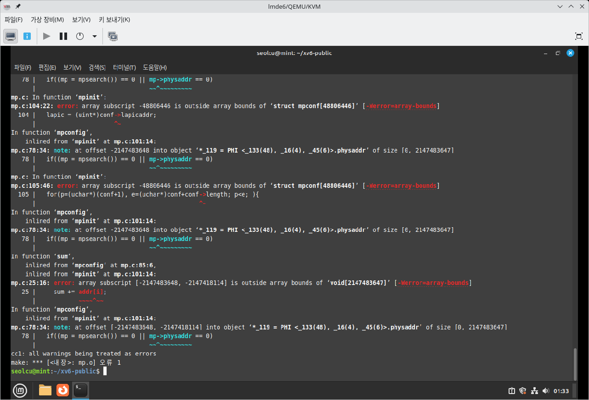
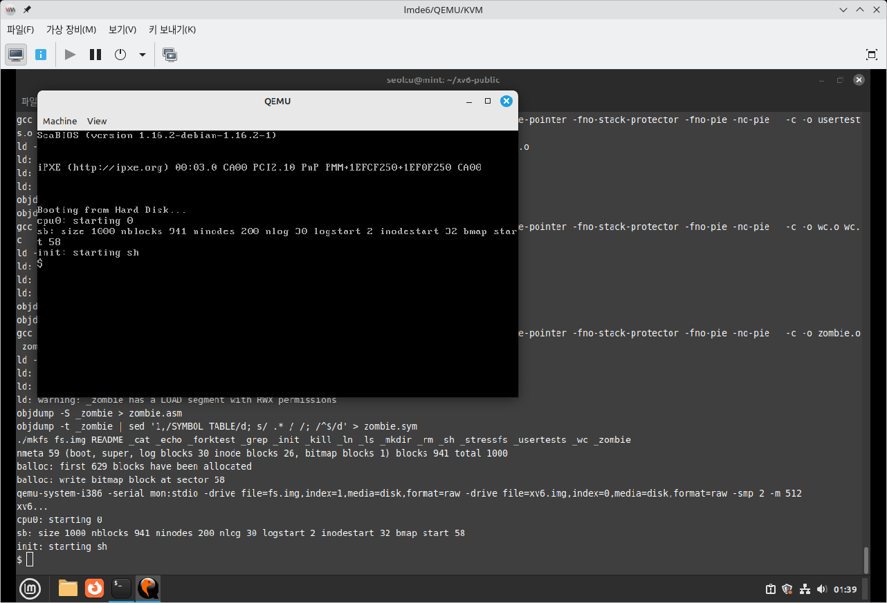
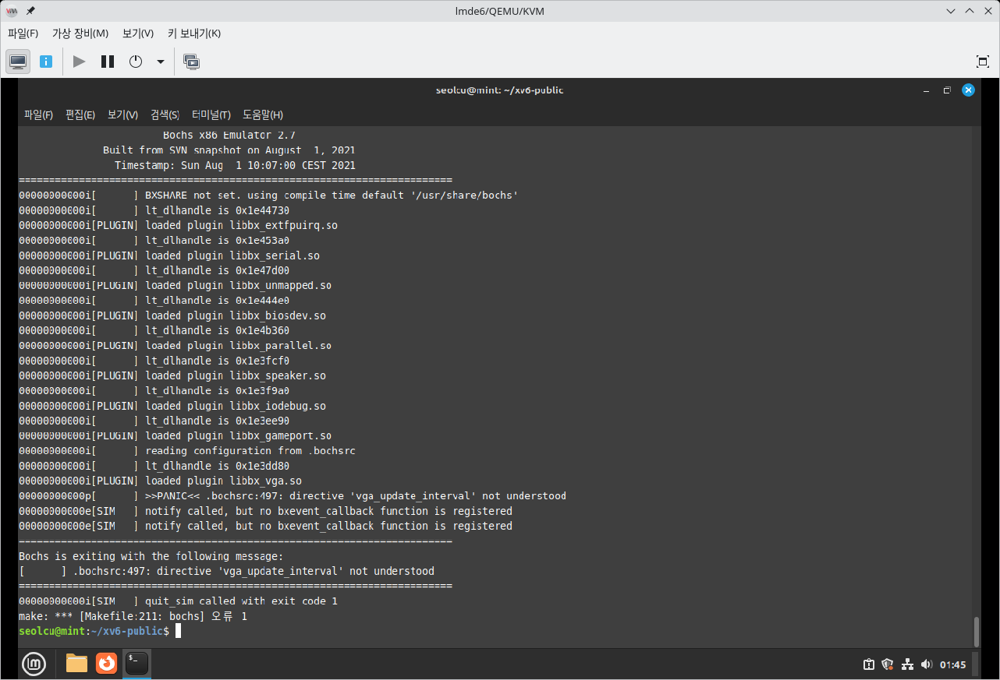
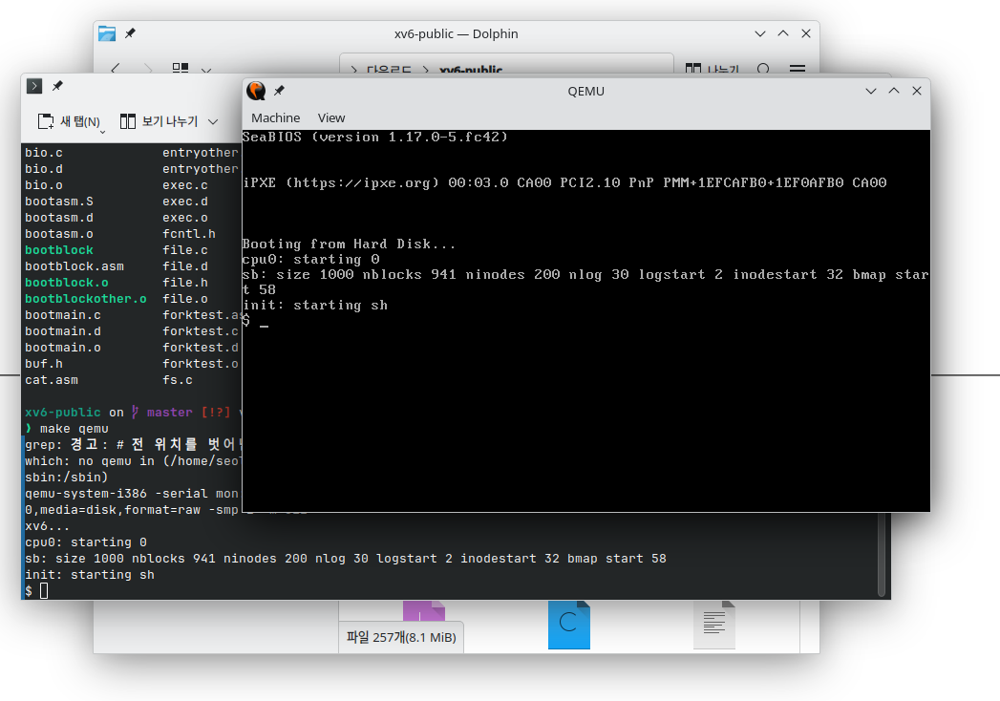

# 1주차 연구내용

목표: 문서 수집 및 학습

## 연구 내용

이번주 목표는 '문서 수집 및 학습'입니다. 하지만 바로 문서만 읽으면 구체적으로 어떤 부분이 부족한지, 뭘 더 배워야 할 지 모를 것 같다는 생각이 들었습니다.

따라서 교수님께서 제안해주신 xv6 체험을 먼저 진행하며, 과정 중에 생기는 구체적인 궁금증들을 해결하는 과정으로 진행하기로 결정했습니다.

### xv6

우선 xv6는 [github](https://github.com/mit-pdos/xv6-public)에 소스 코드가 공개되어 있습니다. 그러나 README.md를 통해 할 수 있듯, 약 5년 전에 x86 버전은 개발이 중단되었고 현재에는 RISC-V 버전만 개발되고 있습니다. 그럼에도 제 프로젝트의 목표는 KVM을 통해 AMD64 환경에서의 가상화를 구현하는 것이기에, x86 코드를 그대로 활용하기로 결정했습니다.

README.md의 'BUILDING AND RUNNING XV6' 부분을 보면, 컴파일과 부팅을 하는 방법이 명시되어 있습니다. x86 크로스컴파일이 가능한 gcc가 설치되어 있는 환경에서 `make` 명령어를 실행하면 컴파일이 되고, `make qemu`를 하면 QEMU 환경에서 실행된다고 써 있습니다.

다만, 코드가 너무 방대한 QEMU보다는 교수님께서 제안하신 Bochs를 레퍼런스로 공부하고 싶기에, `make bochs`로 부팅하면 될 것 같습니다.

#### 컴파일

우선 xv6-public 레포를 로컬로 클론했습니다.

```bash
git clone https://github.com/mit-pdos/xv6-public
```

이후, 폴더에 들어간 후 `make`를 실행했으나 다음과 같은 에러가 발생했습니다:

```
In function ‘mpconfig’,
    inlined from ‘mpinit’ at mp.c:101:14:
mp.c:83:10: error: array subscript -48806446 is outside array bounds of ‘void[2147483647]’ [-Werror=array-bounds=]
   83 |   if(conf->version != 1 && conf->version != 4)
      |      ~~~~^~~~~~~~~
mp.c:78:34: note: at offset -2147483648 into object ‘*<unknown>.physaddr’ of size [0, 2147483647]
   78 |   if((mp = mpsearch()) == 0 || mp->physaddr == 0)
      |                                ~~^~~~~~~~~~
mp.c:85:28: error: array subscript -48806446 is outside array bounds of ‘void[2147483647]’ [-Werror=array-bounds=]
   85 |   if(sum((uchar*)conf, conf->length) != 0)
      |                        ~~~~^~~~~~~~
mp.c:78:34: note: at offset -2147483648 into object ‘*<unknown>.physaddr’ of size [0, 2147483647]
   78 |   if((mp = mpsearch()) == 0 || mp->physaddr == 0)
      |                                ~~^~~~~~~~~~
mp.c: In function ‘mpinit’:
mp.c:104:22: error: array subscript -48806446 is outside array bounds of ‘struct mpconf[48806446]’ [-Werror=array-bounds=]
  104 |   lapic = (uint*)conf->lapicaddr;
      |                      ^~
In function ‘mpconfig’,
    inlined from ‘mpinit’ at mp.c:101:14:
mp.c:78:34: note: at offset -2147483648 into object ‘*<unknown>.physaddr’ of size [0, 2147483647]
   78 |   if((mp = mpsearch()) == 0 || mp->physaddr == 0)
      |                                ~~^~~~~~~~~~
mp.c: In function ‘mpinit’:
mp.c:105:46: error: array subscript -48806446 is outside array bounds of ‘struct mpconf[48806446]’ [-Werror=array-bounds=]
  105 |   for(p=(uchar*)(conf+1), e=(uchar*)conf+conf->length; p<e; ){
      |                                              ^~
In function ‘mpconfig’,
    inlined from ‘mpinit’ at mp.c:101:14:
mp.c:78:34: note: at offset -2147483648 into object ‘*<unknown>.physaddr’ of size [0, 2147483647]
   78 |   if((mp = mpsearch()) == 0 || mp->physaddr == 0)
      |                                ~~^~~~~~~~~~
In function ‘sum’,
    inlined from ‘mpconfig’ at mp.c:85:6,
    inlined from ‘mpinit’ at mp.c:101:14:
mp.c:25:16: error: array subscript [-2147483648, -2147418114] is outside array bounds of ‘void[2147483647]’ [-Werror=array-bounds=]
   25 |     sum += addr[i];
      |            ~~~~^~~
In function ‘mpconfig’,
    inlined from ‘mpinit’ at mp.c:101:14:
mp.c:78:34: note: at offset [-2147483648, -2147418114] into object ‘*<unknown>.physaddr’ of size [0, 2147483647]
   78 |   if((mp = mpsearch()) == 0 || mp->physaddr == 0)
      |                                ~~^~~~~~~~~~
cc1: all warnings being treated as errors
make: *** [<내장>: mp.o] 오류 1
```

에러 코드를 읽어보니, 자료형 변환 부분에서 경고가 발생하는 것 같았습니다. 그리고 `cc1: all warnings being treated as errors`라는 라인을 보았을 때, `-Werror` 플래그가 모든 경고를 에러로 받아들이고 있다는 사실을 알 수 있었습니다.

(이 부분이 실제 코드의 결함일 수도 있고, 제 컴파일러의 버전이 맞지 않는 것일 수도 있습니다. 실제로 코드에 결함이 있다면, 따로 레포를 포크해 개선할 수 있다면 더 좋을 것 같습니다.)
(제 환경은 Fedora 42이고, GCC 버전은 15.2.1 입니다.)

그래서 Makefile을 수정해 `-Werror` 부분을 삭제하고, `make clean` 이후 다시 컴파일했더니, 컴파일 되었습니다. (정상적으로 된 건지는 잘 모르곘습니다.)

#### 부팅

이후 `make bochs`로 부팅해보았으나, 다음과 같은 에러와 함께 실패했습니다:

```
========================================================================
                        Bochs x86 Emulator 3.0
            Built from GitHub snapshot on February 16, 2025
                Timestamp: Sun Feb 16 10:00:00 CET 2025
========================================================================
00000000000i[      ] BXSHARE not set. using compile time default '/usr/share/bochs'
00000000000i[      ] reading configuration from .bochsrc
00000000000p[      ] >>PANIC<< .bochsrc:497: directive 'vga_update_interval' not understood
00000000000e[SIM   ] notify called, but no bxevent_callback function is registered
00000000000e[SIM   ] notify called, but no bxevent_callback function is registered
========================================================================
Bochs is exiting with the following message:
[      ] .bochsrc:497: directive 'vga_update_interval' not understood
========================================================================
00000000000i[SIM   ] quit_sim called with exit code 1
make: *** [Makefile:211: bochs] 오류 1
```

다시 확인해보니, 그냥 bochs를 실행해도 다음과 같은 에러가 뜹니다. .bochsrc 파일이 설정되지 않아서 생기는 문제인 것 같습니다.

([Notes 파일](https://github.com/mit-pdos/xv6-public/blob/master/Notes)에 bochs 관련 정보들이 있는데, 아직은 bochs를 잘 몰라서 어떻게 설정해야 하는지 잘 모르겠습니다.)

따라서, 우선 bochs가 제대로 설정되기 전까지는 xv6가 정상적으로 컴파일되었는지 확인하기 위해 QEMU를 사용하기로 결정했습니다.

`make qemu`, `make qemu-nox`로도 테스트해봤으나, 별다른 에러 메시지 없이, 다음 출력 외에는 몇분동안 아무 반응이 없었습니다.

```
SeaBIOS (version 1.17.0-5.fc42)


iPXE (https://ipxe.org) 00:03.0 CA00 PCI2.10 PnP PMM+1EFCAEC0+1EF0AEC0 CA00


Booting from Hard Disk..
```

컴파일 과정의 문제로 의심이 되어, 검색을 통해 정보를 찾아봤습니다. 그 결과, 한 [Youtube 영상](https://www.youtube.com/watch?v=TLiV_sK77jg)을 발견했습니다.

이 영상에서는 lubuntu 12.04 32bit를 사용하지만, 다운로드 링크가 만료되어있습니다.

64bit 환경인 게 이 문제의 원인이라면, 영상처럼 32bit OS를 활용하면 가능할 것이므로, 데스크탑에 데비안 12를 기반으로 하는 LMDE 6 가상환경을 구성했습니다. (CPU: `kvm32`로 설정해야 virtio 인터넷 연결이 가능합니다.)

이후, 필요한 패키지들을 설치하고 xv6 레포를 클론했습니다.

```bash
sudo apt install git qemu-system qemu-user bochs gcc gcc-multilib build-essential make vim
git clone https://github.com/mit-pdos/xv6-public
```

바로 `make`를 돌려봤습니다.



그 결과, 똑같이 make 과정에서 경고(에러)가 발생했습니다. 이를 보아, xv6 코드 자체의 문제인 것 같습니다.

앞선 해결방법과 똑같이, Makefile에서 `-Werror` 플래그를 삭제하고 `make`로 컴파일한 후, `make qemu`로 실행해보았습니다.



잘 실행되는 모습을 볼 수 있었습니다.



`make bochs`는 여전히 작동하지 않았습니다 (앞서 확인했듯이, .bochsrc가 설정되지 않았습니다.)

#### Fedora 42(x64)에서는 작동하지 않았는데, LMDE 6(x86)에서는 작동한 이유가 무엇인지에 대한 분석

##### 가설 1. 컴파일러의 문제이다.

만약 컴파일러가 문제였다면, LMDE에서 컴파일한 이미지를 Fedora로 넘겨서 qemu로 돌렸을 때 정상적으로 실행되어야 합니다.

따라서, LMDE에서 `make`로 컴파일한 파일을 Fedora로 복사해 `make qemu`로 부팅해봤습니다.



그 결과, qemu로 정상적으로 부팅되는 모습을 볼 수 있었습니다. 이를 통해, 컴파일 과정에서 문제가 발생했음을 확인할 수 있었습니다. 따라서 가설 1이 맞다는 것을 검증할 수 있었습니다.

##### 그러면 Fedora의 컴파일러는 뭐가 잘못된 것이었을까?

우선, [xv6 레포](https://github.com/mit-pdos/xv6-public)의 README에는 다음과 같이 쓰여 있습니다.

```
BUILDING AND RUNNING XV6

To build xv6 on an x86 ELF machine (like Linux or FreeBSD), run
"make". On non-x86 or non-ELF machines (like OS X, even on x86), you
will need to install a cross-compiler gcc suite capable of producing
x86 ELF binaries (see https://pdos.csail.mit.edu/6.828/).
Then run "make TOOLPREFIX=i386-jos-elf-". Now install the QEMU PC
simulator and run "make qemu".
```

그러니까 x86 ELF 환경에서는 그냥 `make`로 컴파일이 되고, 그게 아닌 경우에는 크로스컴파일러를 설정한 후 `make TOOLPREFIX=i386-jos-elf-`를 하면 된다는 것 같습니다. 여기서, "non-x86"에 x86-64가 포함되는건지 아닌건지는 잘 모르겠습니다. 우선 x86-64가 non-x86이 맞다고 가정하고 문제를 해결해보려 했습니다.

##### Fedora에 gcc-multilib 설치

우선 dnf search gcc로 관련 패키지들을 검색해봤습니다.

그러나 어떤게 gcc-multilib에 해당하는지 알 수 없어, 검색을 통해 정보를 찾던 도중 [스택오버플로우 글](https://stackoverflow.com/questions/65863241/gcc-multilib-for-fedora)을 발견해, 다음과 같은 명령어로 제안하는 패키지들을 설치해보았습니다.

```bash
sudo dnf install glibc-devel.i686 libstdc++-devel.i686
```

이후 `make`, `make qemu`를 했으나 여전히 결과는 같았습니다. 글에서 `-static.i686` 접미사 달린 패키지들도 설치하라는 말을 발견했습니다. 그것이 효과가 있을지 보기 위해 `Makefile`을 보니 정말 `-static` 컴파일 옵션이 있는 걸 볼 수 있었습니다. 따라서 "정적 링킹을 위한 glibc 파일이 없어서 문제가 발생했다" 라는 추론을 할 수 있었습니다. 따라서 `dnf search glibc`로 관련 패키지들을 전부 조회해, `glibc-static.i686`이라는 패키지를 발견해 설치했습니다. 그러나, 여전히 문제가 해결되지는 않았습니다.

만약 64비트인게 문제가 아니라 그냥 Fedora인게 문제라면, 추후 distrobox를 활용해 데비안/우분투 기반으로 다시 컴파일 했을 때 될 수도 있겠습니다.

#### 컴파일에 관한 결정

문제가 아직 해결되지 않아서 마음이 불편한 부분이 있지만, 우선 LMDE에서 컴파일한 파일이 있으므로 당분간은 그걸 계속 사용하기로 결정했습니다. 따라서 복사한 레포 + 컴파일된 이미지를 .zip파일로 묶어 이 프로젝트 레포의 archive 폴더에서 관리할 수 있도록 했습니다.

### Bochs

앞서 xv6 컴파일 및 부팅 과정에서 파악한 현재의 문제는 대략 두가지입니다.

1. 컴파일 환경의 불안정성 (LMDE에서 컴파일해 해결.)
2. Bochs 사용법에 대한 이해 부족

1번은 어느정도 해결했으므로 큰 문제는 아닙니다. 이 프로젝트의 주제가 xv6같은 운영체제 그 자체가 아닌, qemu나 bochs같은 하이퍼바이저이기 때문입니다. 따라서 xv6가 실행될 수 있도록 컴파일된 현재의 상황에서는 큰 문제가 되지 않습니다.

하지만, 2번은 확실한 문제입니다. 따라서 지금 집중해야 하는 부분은 Bochs에 대한 문서를 수집하고, `.bochsrc`를 가져오거나 작성하는 것, 그리고 `make bochs`를 성공시키는 것입니다. 이를 성공하면 2주차 과정에서 구조를 설계하는 데 큰 도움이 될 것입니다.

#### 문서 수집 및 학습

주요 문서들은 메인 README.md에 정리했습니다.

우선 [GitHub](https://github.com/bochs-emu/Bochs)의 README.md를 읽어보면, Bochs는 C++로 짜여진 x86 **에뮬레이터**입니다. 즉, VMware나 Virtualbox에서 구현하는 가상화 또는 JVM같은 JIT 컴파일러와 다릅니다. 에뮬레이터라는 특성 덕분에, x86 뿐만 아니라 ARM, MIPS 등의 다양한 아키텍처 위에서도 x86 환경을 에뮬레이팅 할 수 있습니다.

제가 진행할 프로젝트는 KVM을 이용한 가상화에 초점을 맞췄기에, 이런 부분에서 Bochs와 차이점을 가집니다.

README 아래에는 베이징 ISCA-35에서 발표된, Portable VM에 관한 발표의 [PPT 파일](https://bochs.sourceforge.io/VirtNoJit.pdf)이 있습니다. 이 자료에서는 여러 가상화/에뮬레이션 기술들을 소개합니다. 대부분의 내용을 이해하지는 못했지만, 이해한 부분을 정리하자면:

- JIT나 하드웨어 기반 가상화가 아닌, 한줄씩 번역하는 인터프리터 방식을 차용한다.
  - 따라서 디버깅이 쉽고, 이식성이 좋다. 이를 통해 CPU와의 완전한 격리를 이뤄낼 수 있다.
- fetch-decode-dispatch 순서대로 명령을 처리한다.
  - Bochs는 50% 이상의 시간을 이 사이클에 소요한다.
  - decode된 명령어는 i-cache에 저장된다.
- Lazy Flag 방식을 사용한다.

#### xv6 구동하기

앞선 단계에서, `make bochs`는 에러를 출력하며 구동되지 않았습니다. 그리고 그 문제는 `.bochsrc` 파일이 없어서 그런 것 같습니다.

QEMU는 구동 옵션을 인라인으로 다 넣기 때문에 따로 설정파일을 만들지 않아도 작동한 것 같지만, Bochs는 그렇지 않아 `.bochsrc` 파일을 만들거나, 또는 누군가 만들어 놓은 설정 파일을 가져와야 할 것 같습니다.

우선 검색을 통해 다음 설정 파일을 찾았습니다: [dot-bochsrc by Thomas Nguyen](https://gitlab07.cs.washington.edu/tomn/lvisor-18wi/-/blob/master/tests/xv6-src/dot-bochsrc)

해당 파일을 복사해 그대로 .bochsrc로 만들어보았으나, 여전히 같은 에러를 출력하며 잘 작동하지 않았습니다.

추가적으로 정보를 더 찾아봤으나 마땅한 설정 파일을 찾지 못하여, 2차시에 Bochs에 대해 공부하면서 .bochsrc 또한 [공식 Documentation](https://bochs.sourceforge.io/doc/docbook/user/bochsrc.html)과 같이 공부하겠습니다.

## 다음주 todo:

- `.bochsrc` 설정 파일 세팅하기
- `Bochs`를 레퍼런스로, 실질적인 VMM 구조 설계하기
- 개발 환경 구축 (C)
- (시간이 남는다면,) Fedora에서 xv6이 컴파일되지 않은 이유 조사. (만약 Fedora가 문제라면 Distrobox를 이용해 컨테이너 위 컴파일 진행)
- (시간이 남는다면,) xv6 소스 코드를 포크하고 개선해 `-Werror` 플래그를 지우지 않고도 성공적으로 컴파일되도록 개선
