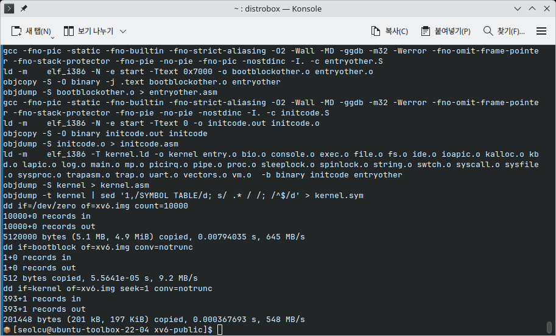
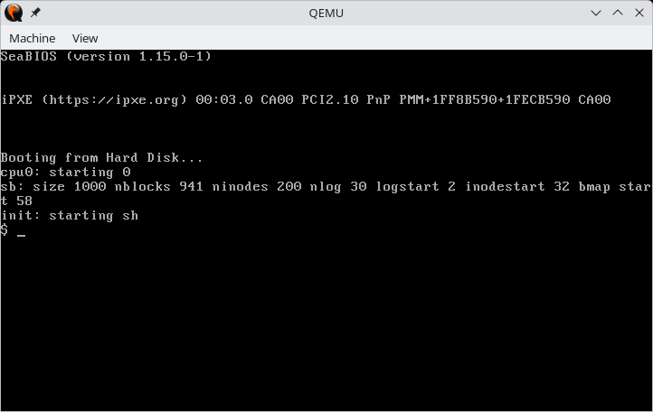
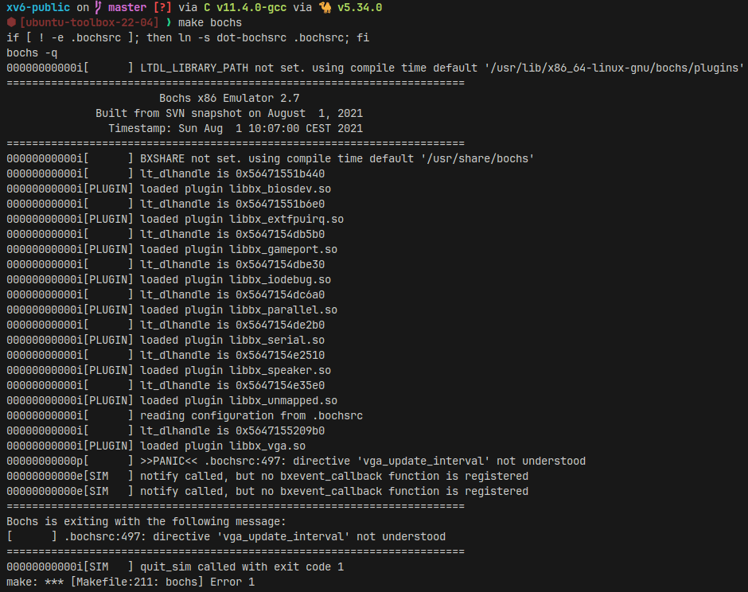
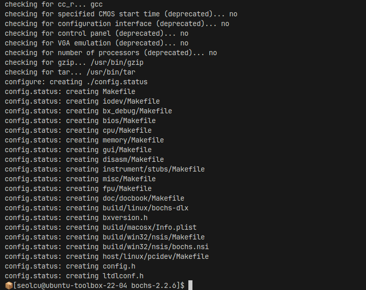
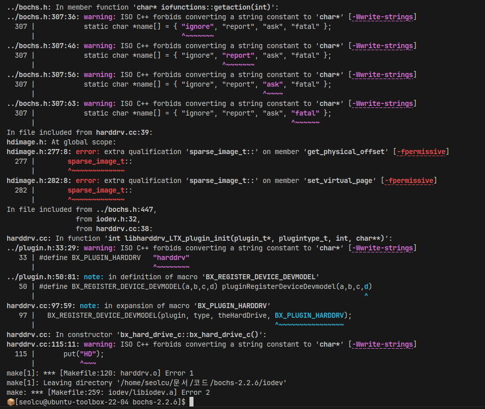

# 2주차 연구내용

목표: 구조 설계, 개발 환경 구축, Git 저장소 생성

저번주 todo:

- `.bochsrc` 설정 파일 세팅하기
- `Bochs`를 레퍼런스로, 실질적인 VMM 구조 설계하기
- 개발 환경 구축 (C)
- (시간이 남는다면,) Fedora에서 xv6이 컴파일되지 않은 이유 조사. (만약 Fedora가 문제라면 Distrobox를 이용해 컨테이너 위 컴파일 진행)
- (시간이 남는다면,) xv6 소스 코드를 포크하고 개선해 `-Werror` 플래그를 지우지 않고도 성공적으로 컴파일되도록 개선

## 연구 내용

이번주 목표는 '코드 구조 설계 및 개발 환경 구축'입니다. 또한 저번에 해결하지 못한 bochs 부팅까지 해결할 계획입니다.

### xv6 컴파일 문제 해결하기

#### 문제점 분석

저번주에 발생한 xv6 컴파일 관련 문제는 다음 두가지입니다.

1. 컴파일 과정 중 생기는 경고가 `-Werror` 플래그에 걸려 컴파일이 실패하는 것.
2. 컴파일 후, `make qemu`가 정상적으로 실행되지 않는것.

1번 문제의 경우에는, 저번주에 임시로 `-Werror` 플래그를 제거해서 해결했습니다. 그러나, 교수님께서 '컴파일러 버전에 따라 처리 방식이 다르다'고 조언해주셨으니, 다양한 버전으로 테스트해보는 과정이 필요할 것 같습니다.

2번 문제의 경우에는, LMDE 32bit 환경에서 컴파일해 해결했습니다. Fedora의 multilib 컴파일러가 제대로 작동하지 않은 것 같으니, 다른 배포판으로도 테스트를 해봐야겠습니다.

따라서, 1번과 2번을 동시에 해결하기 위해 다양한 배포판들을 [distrobox](https://distrobox.it/)로 테스트하기로 결정했습니다. distrobox는 도커 기반의 리눅스 컨테이너를 간단하게 생성할 수 있도록 해주는 툴으로, 권한 설정과 홈 폴더 공유와 같은 번거로운 작업을 간단하게 해결해줍니다.

#### 다른 학교의 사례 분석

무작정 배포판들을 테스트해보기보단, 우선 교수님께서 조언해주신 대로 여러 학교들의 사례를 찾아보았습니다.

- 서울대, 연세대: xv6-riscv 버전을 사용중인 것으로 확인됨 (해당없음)
- KAIST: [KAIST OSLAB](https://oslab.kaist.ac.kr/xv6-install/), 데비안 기반 (우분투로 추정됨)의 운영체제를 사용함.
- 아주대: 공개된 정보 없음.

따라서 KAIST 관련 정보로 검색하다, 다음 [블로그 글](https://velog.io/@uooee8633/M1-%EB%A7%A5%EB%B6%81%EC%97%90%EC%84%9C-XV6qemu-%EB%B9%8C%EB%93%9C%ED%95%98%EA%B8%B0)을 확인했습니다.

해당 글에서는 Ubuntu 22.04 (64bit)에서 컴파일이 성공한 것을 확인할 수 있었습니다.

따라서, distrobox로 Ubuntu 22.04 환경을 먼저 구성해보았습니다.

#### Ubuntu 22.04 테스트

우선 distrobox로 Ubuntu 22.04 이미지를 다운로드해, 컨테이너를 생성하고 실행했습니다.

```bash
distrobox create -i quay.io/toolbx/ubuntu-toolbox:22.04
distrobox enter ubuntu-toolbox-22-04
```

이후, 필요한 패키지들을 설치했습니다. `make`와 `gcc-multilib`같은 패키지들은 `build-essential` 메타패키지로 한번에 설치됩니다.

```bash
sudo apt install build-essential qemu-system -y
```

xv6 레포를 git으로 클론해줬습니다. git은 컨테이너에 기본적으로 설치되어있었습니다.

```bash
git clone https://github.com/mit-pdos/xv6-public
cd xv6-public
```

바로 `make`로 컴파일해보았습니다.



컴파일 에러 없이 잘 컴파일 된 것을 볼 수 있었습니다. 이로서, 앞선 1번 `-Werror` 문제는 컴파일러 버전(배포판)을 바꿔서 해결할 수 있었습니다.

따라서, 바로 `make qemu`로 실행도 해보았습니다.



문제없이 바로 실행되었습니다... 이로서 2번 문제도 해결했습니다.

그냥 처음부터 우분투 기준으로 해볼걸... 하는 생각이 들지만, 이 과정을 컴파일러 버전의 중요성을 배울 수 있었습니다.

##### xv6 fork

프로젝트 관리를 위해, xv6 레포지토리를 fork했습니다. 그리고 README에 distrobox를 이용한 컴파일 가이드를 작성했습니다. 앞으로 xv6 코드에 변경사항이 생기면 이 레포지토리로 관리할 것입니다.

[https://github.com/seolcu/xv6-public](https://github.com/seolcu/xv6-public)

#### Bochs를 이용한 부팅 도전

우선 컨테이너에 bochs를 설치해줬습니다.

```bash
sudo apt install bochs
```

그리고 `make bochs`를 실행했습니다. 1주차와 같은 오류가 발생했습니다. 1주차에 교수님께서 .bochsrc 설정법을 설명해 주셨으니, 그에 따라 고쳐보려고 합니다.



우선 아래의 Makefile을 보면, 아래 부분에서 `dot-bochsrc` 파일을 가르키는 소프트링크로 `.bochsrc` 파일을 생성하는 것을 볼 수 있습니다. 따라서 `dot-bochsrc`를 수정하려 합니다.

```makefile
bochs : fs.img xv6.img
	if [ ! -e .bochsrc ]; then ln -s dot-bochsrc .bochsrc; fi
	bochs -q
```

#### 환경변수와 bochsbios

dot-bochsrc를 읽어보기 전에, 앞선 `make bochs`에서의 출력 메시지에서 환경변수 설정을 볼 수 있었습니다.

```
00000000000i[      ] LTDL_LIBRARY_PATH not set. using compile time default '/usr/lib/x86_64-linux-gnu/bochs/plugins'
========================================================================
                        Bochs x86 Emulator 2.7
              Built from SVN snapshot on August  1, 2021
                Timestamp: Sun Aug  1 10:07:00 CEST 2021
========================================================================
00000000000i[      ] BXSHARE not set. using compile time default '/usr/share/bochs'
```

`LTDL_LIBRARY_PATH`은 `/usr/lib/x86_64-linux-gnu/bochs/plugins`로 설정되고,

`BXSHARE`는 `/usr/share/bochs`로 설정되는 것을 볼 수 있었습니다.

컨테이너에서 확인하니, 두 경로 모두 정상적으로 존재하는 것을 볼 수 있었습니다.

그러나, dot-bochsrc에서 다음과 같은 라인을 발견할 수 있었습니다.

```
romimage: file=$BXSHARE/BIOS-bochs-latest
```

이를 보면, `/usr/share/bochs/BIOS-bochs-latest`라는 파일이 존재해야 하는 것을 알 수 있습니다. 그러나, 실제로는 해당 위치에 파일이 존재하지 않았습니다. 따라서 `apt search bochs`를 하니, 몇몇 관련 패키지들이 설치되지 않았다는 사실을 알 수 있었습니다.

따라서 `sudo apt install bochsbios`를 진행하니, 해당 위치에 BIOS-bochs-latest 파일이 정상적으로 생겨났습니다.

비슷하게, `bochs-term`, `vgabios` 등도 설치가 필요했습니다.

#### Ubuntu의 Bochs 패키지로 실행 실패

앞선 패키지들을 모두 설치했음에도, 다음과 같은 에러가 계속 발생했습니다.

```
00000000000p[      ] >>PANIC<< .bochsrc:497: directive 'vga_update_interval' not understood
00000000000e[SIM   ] notify called, but no bxevent_callback function is registered
00000000000e[SIM   ] notify called, but no bxevent_callback function is registered
========================================================================
Bochs is exiting with the following message:
[      ] .bochsrc:497: directive 'vga_update_interval' not understood
========================================================================
00000000000i[SIM   ] quit_sim called with exit code 1
make: *** [Makefile:211: bochs] Error 1
```

에러에 해당하는 부분을 전부 주석처리해보았으나, 메모리 부분에서 계속 커널 패닉이 발생하며 실행에 실패했습니다.

따라서, 잠시 멈춰서 문제의 원인을 떠올려봤습니다.

생각해보니, xv6의 코드는 약 15년 전에 작성되었으므로, 그 당시의 Bochs의 설정 파일 형식과 현재의 설정 파일 형식이 믾이 다르겠다는 생각이 들었습니다.

그래서 16.04 컨테이너를 새로 만들어 해봤으나, 여전히 같은 문제에 부딪혔습니다.

그러다, 1주차에서 보았던 Notes 파일이 떠올랐습니다.

#### Bochs 2.2.6

xv6 레포에는 Notes라는 파일이 있고, 그 파일 안에는 이런 내용이 있습니다.

```
bochs 2.2.6:
./configure --enable-smp --enable-disasm --enable-debugger --enable-all-optimizations --enable-4meg-pages --enable-global-pages --enable-pae --disable-reset-on-triple-fault
bochs CVS after 2.2.6:
./configure --enable-smp --enable-disasm --enable-debugger --enable-all-optimizations --enable-4meg-pages --enable-global-pages --enable-pae
```

따라서, 이를 참고해 2.2.6 버전을 사용해보기로 했습니다.

해당 버전은 GitHub에는 존재하지 않아서, [Sourceforge](https://sourceforge.net/projects/bochs/files/bochs/)에서 [Bochs 2.2.6](https://master.dl.sourceforge.net/project/bochs/bochs/2.2.6/bochs-2.2.6.tar.gz)을 다운받을 수 있었습니다.

```bash
wget https://master.dl.sourceforge.net/project/bochs/bochs/2.2.6/bochs-2.2.6.tar.gz
tar -xvf bochs-2.2.6.tar.gz
rm bochs-2.2.6.tar.gz
cd bochs-2.2.6
```

그대로 `./configure ...`를 하니, 다음과 같은 에러가 발생했습니다.

```
ERROR: X windows gui was selected, but X windows libraries were not found.
```

Distrobox 컨테이너는 minimal이기에 xorg는 기본적으로 설치되지 않습니다. 따라서, `xorg-dev` 패키지를 설치해 라이브러리를 충족해주고, `./configure ...`를 실행했습니다.

```bash
sudo apt install xorg-dev
./configure --enable-smp --enable-disasm --enable-debugger --enable-all-optimizations --enable-4meg-pages --enable-global-pages --enable-pae --disable-reset-on-triple-fault
```

`./configure ...`는 성공적으로 진행되었습니다.



하지만, `make` 단계에서 컴파일 에러가 발생해 또 막히게 되었습니다.



컴파일러 버전 문제를 의심하여, Ubuntu 16.04에서 다시 해 보았으나 여전히 같은 문제가 발생했습니다.

따라서 우선 이 문제는 보류해두고, 오늘의 주 목표인 코드 구조 설계 및 개발 환경 구축을 진행했습니다.
