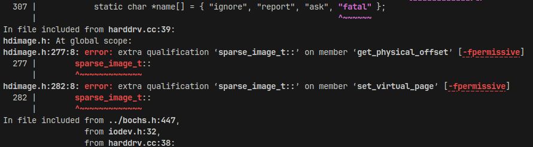
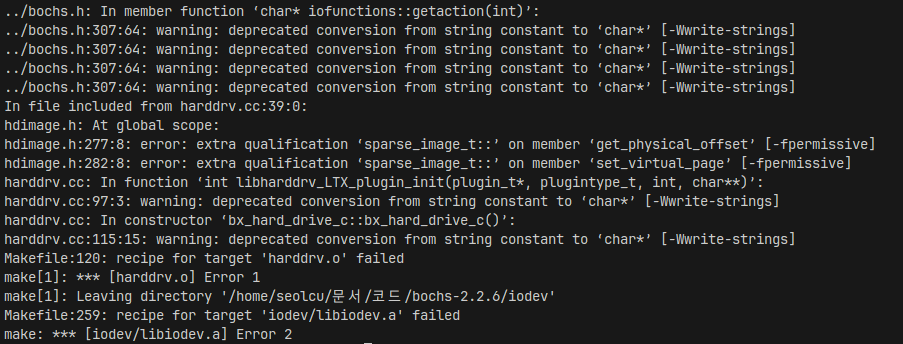
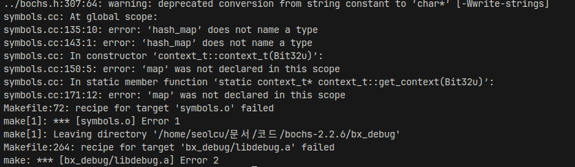
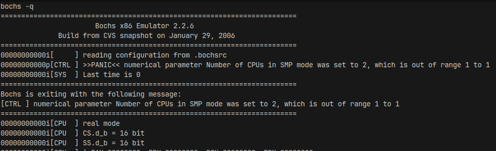
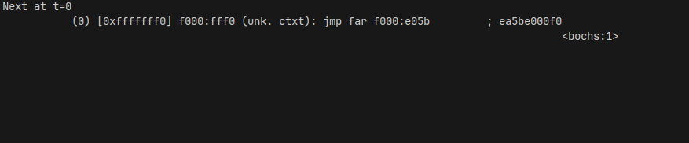
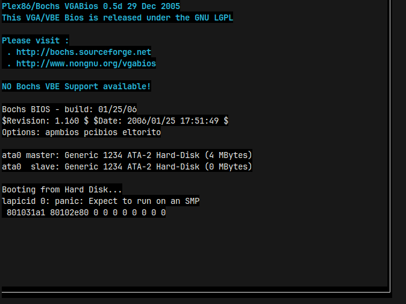

# 3주차 연구내용

목표: VM 생성 및 메모리 할당 코드 작성

저번주 todo:

- Bochs 코드 리뷰
- 프로젝트 코드 구조 설계
- (KVM) VM 생성 및 메모리 할당 코드 작성

## 연구 내용

### Bochs 2.2.6 컴파일

#### Configure

우선 저번주에 이어서 Bochs 2.2.6 컴파일을 이어서 해봤습니다.

저번주에 사용한 configure 명령은 아래와 같았습니다. (xv6 레포의 Notes 파일에서 발견된 명령어입니다.)

```bash
./configure --enable-smp --enable-disasm --enable-debugger --enable-all-optimizations --enable-4meg-pages --enable-global-pages --enable-pae --disable-reset-on-triple-fault
```

그리고 이를 컴파일하면 다음와 같은 에러가 발생했었습니다.

```
ERROR: X windows gui was selected, but X windows libraries were not found.
```

저번주에는 xorg를 설치해 해결하려 했으나, 교수님과 상담 후 `--with-term` 옵션을 주기로 결정했습니다. 또한, 멀티코어를 활성화하는 `--enable-smp` 옵션과, 최적화 및 페이징과 관련된 옵션들인 `--enable-all-optimizations --enable-4meg-pages --enable-global-pages --enable-pae`도 모두 삭제하기로 했습니다.

```bash
./configure --enable-disasm --enable-debugger --disable-reset-on-triple-fault --with-term
```

그랬더니, 다음과 같은 에러가 발생했습니다.

```
Curses library not found: tried curses, ncurses, termlib and pdcurses.
```

Curses 관련 라이브러리가 없다고 떠서, 아래 명령어로 설치해줬습니다. (Ubuntu 22.04 기준)

```bash
sudo apt install libncurses-dev
```

이후 같은 옵션으로 configure가 정상적으로 진행되었습니다. (X window 관련 문제가 발생하지 않는 걸 보니, term을 켜면 vga는 저절로 꺼지는 것 같습니다.) 따라서 바로 `make`를 진행해봤습니다. 그랬더니 수많은 warning과 함께, 아래와 같은 에러가 발생했습니다.



아무래도 GCC 버전이 달라 C++ 표준이 달라져서 생긴 에러인 것 같습니다.

#### GCC 버전 낮추기

따라서 시스템의 GCC 버전을 더 낮추기로 했습니다. 그래서 더 찾아보던 중, [C++과 GCC에 관한 블로그 글](https://dulidungsil.tistory.com/entry/GCC-%EB%B2%84%EC%A0%84%EA%B3%BC-C-%EB%B2%84%EC%A0%84-%EB%A7%A4%EC%B9%AD)을 하나 발견했습니다. 이 글에는 이렇게 쓰여있습니다:

> 1998년에 첫 번째 표준인 C++ 98이 공개된 후 오랜 기간동안 정체기를 거치다가 2011년이 되어서야 새로운 개념들이 추가된 버전이 공개되었습니다. C++ 11부터 Modern C++ 이라고 부릅니다.
>
> - trusty: Ubuntu 14.04, xenial: Ubuntu 16.04, bionic: Ubuntu 18.04
> - focal: Ubuntu 20.04,
> - jammy: Ubuntu 22.04, kinetic: Ubuntu 22.10
> - lunar: Ubuntu 23.04

우선 현재 사용중이던 Ubuntu 22.04에는 gcc 4.8 미만을 설치할 수 없었습니다.

따라서 distrobox에서 제공하는 가장 낮은 Ubuntu 버전인 Ubuntu 16.04를 설치하고 build-essential을 설치해봤습니다.

```bash
distrobox create -i quay.io/toolbx/ubuntu-toolbox:16.04
```

```bash
sudo apt install build-essential
```

이후 gcc 버전을 확인해보았습니다.

```
gcc (Ubuntu 5.4.0-6ubuntu1~16.04.12) 5.4.0 20160609
Copyright (C) 2015 Free Software Foundation, Inc.
This is free software; see the source for copying conditions.  There is NO
warranty; not even for MERCHANTABILITY or FITNESS FOR A PARTICULAR PURPOSE.
```

기본 설치된 gcc 버전은 5.4.0이었습니다. 따라서 apt로 gcc-4.7을 직접 설치해보았습니다.

```bash
sudo apt install gcc-4.7 gcc-4.7-multilib g++-4.7 g++-4.7-multilib
```

그리고 gcc 4.7을 기본 컴파일러로 사용하기 위해, [update-alternatives와 관련된 블로그 글](https://blog.koriel.kr/gcc-g-dareun-beojeon-cugahago-paekiji-gwanrihagi/)을 통해 gcc 4.7을 기본으로 설정했습니다.

```bash
sudo update-alternatives --install /usr/bin/gcc gcc /usr/bin/gcc-4.7 10
sudo update-alternatives --install /usr/bin/g++ g++ /usr/bin/g++-4.7 10
```

이제 gcc 4.7이 설치되었습니다:

```
$ gcc --version
gcc (Ubuntu/Linaro 4.7.4-3ubuntu12) 4.7.4
Copyright (C) 2012 Free Software Foundation, Inc.
This is free software; see the source for copying conditions.  There is NO
warranty; not even for MERCHANTABILITY or FITNESS FOR A PARTICULAR PURPOSE.
```

따라서 바로 configure 후 make 해보았습니다:



여전히 같은 문제로 컴파일에 실패했습니다.

#### hdimage.h 고치기

컴파일러 버전을 최대한 낮췄음에도 컴파일이 되지 않으니, 직접 코드를 수정해 컴파일되도록 만들기로 했습니다.

컴파일 에러는 다음과 같습니다:

```
hdimage.h: At global scope:
hdimage.h:277:8: error: extra qualification ‘sparse_image_t::’ on member ‘get_physical_offset’ [-fpermissive]
hdimage.h:282:8: error: extra qualification ‘sparse_image_t::’ on member ‘set_virtual_page’ [-fpermissive]
```

해당하는 부분은 `iodev/hdimage.h` 파일입니다. 문제가 되는 부분은 아래와 같습니다:

```C
off_t
#ifndef PARANOID
       sparse_image_t::
#endif
                       get_physical_offset();
 void
#ifndef PARANOID
       sparse_image_t::
#endif
                       set_virtual_page(Bit32u new_virtual_page);
```

`sparse_image_t` 클래스 안에서 그 클래스를 스스로 호출해 생긴 문제인 것 같습니다. 이 코드를 다음과 같이 고쳤습니다:

```C
off_t get_physical_offset();
void set_virtual_page(Bit32u new_virtual_page);
```

그랬더니, 다음과 같은 에러가 발생했습니다:



#### symbols.cc 고치기

에러 메시지는 다음과 같았습니다:

```
symbols.cc: At global scope:
symbols.cc:135:10: error: ‘hash_map’ does not name a type
symbols.cc:143:1: error: ‘hash_map’ does not name a type
symbols.cc: In constructor ‘context_t::context_t(Bit32u)’:
symbols.cc:150:5: error: ‘map’ was not declared in this scope
symbols.cc: In static member function ‘static context_t* context_t::get_context(Bit32u)’:
symbols.cc:171:12: error: ‘map’ was not declared in this scope
Makefile:72: recipe for target 'symbols.o' failed
make[1]: *** [symbols.o] Error 1
make[1]: Leaving directory '/home/seolcu/문서/코드/bochs-2.2.6/bx_debug'
Makefile:264: recipe for target 'bx_debug/libdebug.a' failed
make: *** [bx_debug/libdebug.a] Error 2
```

문제가 되는 부분은 `bx_debug/symbols.cc` 파일이었습니다. 라인 135 근처를 확인했습니다.

```C
private:
  static hash_map<int,context_t*>* map;
  // Forvard references (find name by address)
  set<symbol_entry_t*,lt_symbol_entry_t>* syms;
  // Reverse references (find address by name)
  set<symbol_entry_t*,lt_rsymbol_entry_t>* rsyms;
  Bit32u id;
};

hash_map<int,context_t*>* context_t::map = new hash_map<int,context_t*>;
```

hash_map이라는 것을 타입을 사용하지만, 컴파일러가 이를 못 찾는 것 같습니다.

따라서 이 타입을 불러오는 include 부분을 살펴봤습니다.

```C
/* Haven't figured out how to port this code to OSF1 cxx compiler.
   Until a more portable solution is found, at least make it easy
   to disable the template code:  just set BX_HAVE_HASH_MAP=0
   in config.h */
#if BX_HAVE_HASH_MAP
#include <hash_map>
#elif BX_HAVE_HASH_MAP_H
#include <hash_map.h>
#endif
```

OSF1 cxx 컴파일러와의 호환성을 위해 임시로 사용한 전역변수의 흔적이 남아있습니다. 또한 `hash_map`이라는 타입이, `unordered_map`이 등장하며 비표준으로 옮겨졌으므로, `<ext/hash_map>`으로 바꿔줬습니다.

```C
#include <ext/hash_map>
using namespace __gnu_cxx;
```

make 해보니 다음과 같은 에러가 발생했습니다:

```
yacc -p bx -d parser.y
make[1]: yacc: Command not found
Makefile:104: recipe for target 'parser.c' failed
make[1]: *** [parser.c] Error 127
make[1]: Leaving directory '/home/seolcu/문서/코드/bochs-2.2.6/bx_debug'
Makefile:264: recipe for target 'bx_debug/libdebug.a' failed
make: *** [bx_debug/libdebug.a] Error 2
```

yacc가 설치되지 않은 것 같아, 터미널에 입력하니 `bison` 패키지 설치를 권유받았습니다. 따라서 `bison`을 설치하고 `make`를 진행해보았더니, 드디어 정상적으로 컴파일되었습니다. 따라서 바로 `sudo make install`로 설치까지 진행했습니다.

그리고, 지금까지의 과정을 통해 알아낸 Bochs 2.2.6 컴파일 방법을 [seolcu/bochs-2.2.6](https://github.com/seolcu/bochs-2.2.6) 레포에 가이드로 작성했습니다.

### Bochs 2.2.6으로 xv6 부팅

바로 xv6를 실행하기 위해, `make` 후 `make bochs` 해봤습니다.



CPU 개수 관련 에러가 발생했습니다. 역시 `.bochsrc` 파일을 수정할 필요가 있어보입니다.

#### CPU 설정

원래 설정:

```
cpu: count=2, ips=10000000
```

CPU 개수 1개로 조정:

```
cpu: count=1, ips=10000000
```

#### ATA 설정

CPU 설정 이후 다음과 같은 에러가 발생했습니다:

```
========================================================================
                       Bochs x86 Emulator 2.2.6
              Build from CVS snapshot on January 29, 2006
========================================================================
00000000000i[     ] reading configuration from .bochsrc
00000000000i[     ] installing term module as the Bochs GUI
00000000000i[     ] Warning: no rc file specified.
00000000000i[     ] using log file bochsout.txt
========================================================================
Bochs is exiting with the following message:
[HD   ] ata0/1 image size doesn't match specified geometry
========================================================================
Makefile:210: recipe for target 'bochs' failed
make: *** [bochs] Error 1
```

이 부분과 관련된 설정은 다음 부분인 것 같았습니다:

```
ata0-master: type=disk, mode=flat, path="xv6.img", cylinders=100, heads=10, spt=10
ata0-slave: type=disk, mode=flat, path="fs.img", cylinders=1024, heads=1, spt=1
```

뒤에 있는 cylinders, heads, spt 값이 올바르지 않아서 부팅에 문제가 생긴건지 확인하기 위해, [bochsrc 공식 문서](https://bochs.sourceforge.io/doc/docbook/user/bochsrc.html)와 [위키피디아 CHS 문서](https://ko.wikipedia.org/wiki/%EC%8B%A4%EB%A6%B0%EB%8D%94-%ED%97%A4%EB%93%9C-%EC%84%B9%ED%84%B0)를 읽으며 값을 계산헀습니다.

디스크 사이즈 계산식은 다음과 같습니다:

```
총 크기 (바이트) = 실린더 수 × 헤드 수 × 트랙당 섹터 수 × 섹터당 바이트 수(512)
```

따라서, 다음과 같이 정리가 가능합니다:

```
총 크기 (바이트) = cylinders * heads * spt(secter per track) * 512
```

##### ata0-master

따라서 ata0-master의 디스크 사이즈 기대값은, 100 \* 10 \* 10 \* 512 = 5120000입니다. 이 값이 xv6.img의 크기와 일치해야합니다. 확인해보면:

```
$ ls -l xv6.img
-rw-r--r--. 1 seolcu seolcu 5120000  9월 23 12:08 xv6.img
```

이미지 사이즈가 5120000이므로, ata0-master의 디스크 사이즈는 맞습니다.

##### ata0-slave

다음으로 ata0-slave의 디스크 사이즈 기대값은, 1024 \* 1 \* 1 \* 512 = 524288입니다. fs.img를 확인해보면:

```
$ ls -l fs.img
-rw-r--r--. 1 seolcu seolcu 512000  9월 23 12:08 fs.img
```

이미지 사이즈가 512000으로, 일치하지 않는 것을 확인할 수 있었습니다.

이를 해결하기 위해 cylinders를 1024에서 1000으로 조정했습니다.:

```
ata0-master: type=disk, mode=flat, path="xv6.img", cylinders=100, heads=10, spt=10
ata0-slave: type=disk, mode=flat, path="fs.img", cylinders=1000, heads=1, spt=1
```

#### 디버거 때문? 인풋 안 들어감

이후 make bochs를 하니, 아래와 같이 뭔가 이상하게 돌아갔습니다. 아무 입력이 들어가지 않았습니다.



bochs 컴파일할 때 `--enable-debugger` 옵션을 켜서 디버거로 들어간건가 하는 생각에, 그 플래그를 빼고 다시 컴파일하고 실행해보았습니다.

#### SMP



SMP가 꺼져 있어서 커널 패닉이 발생한 것 같습니다. xv6에서 듀얼코어 이상을 요구하는 것 같습니다. 우선은 다음주로 넘겨둬야겠습니다.

## 다음주 todo

- 전체 점검
