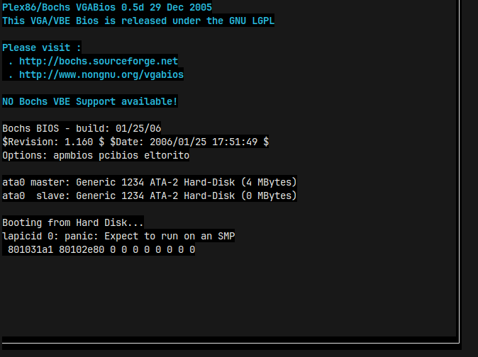
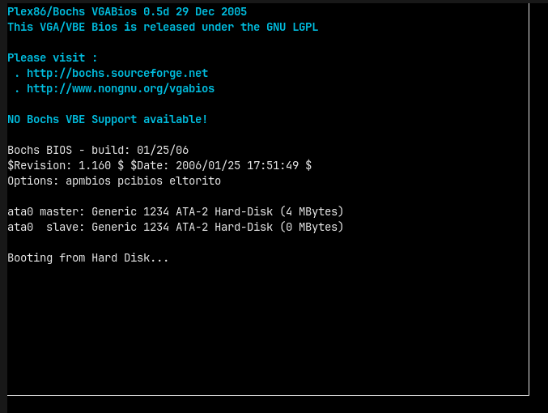
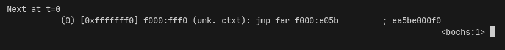
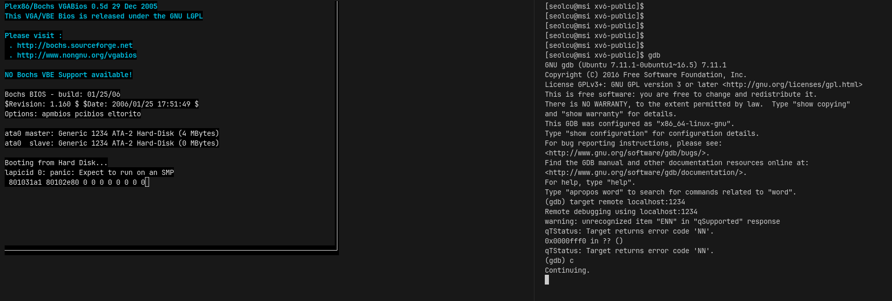

# 4주차 연구내용

목표: 계획 점검, 오픈소스 코드 리뷰, 추가 학습

저번주 todo:

- 전체 점검

## 연구내용

### SMP 관련 문제 해결하기

저번주에 Bochs 2.2.6을 컴파일하고 xv6를 디버거 없이 부팅해보았을때, 다음과 같은 에러가 발생했습니다.



교수님께서 xv6가 듀얼코어를 요구할 것 같지는 않다고 하셨기에, .bochsrc 수정 없이 bochs 2.2.6 컴파일 옵션만 수정해보기로 했습니다.

따라서 `--enable-smp` 옵션을 주어 컴파일해보았습니다.

```bash
./configure --enable-smp --enable-disasm --disable-reset-on-triple-fault --with-term
```

컴파일 이후 `make bochs` xv6를 부팅해보니, 되는듯 하더니 다음과 같은 에러가 발생했습니다.

```
========================================================================
                       Bochs x86 Emulator 2.2.6
              Build from CVS snapshot on January 29, 2006
========================================================================
00000000000i[     ] reading configuration from .bochsrc
00000000000i[     ] installing term module as the Bochs GUI
00000000000i[     ] using log file bochsout.txt
========================================================================
Bochs is exiting with the following message:
[CPU0 ] exception(): 3rd (14) exception with no resolution
========================================================================
Makefile:210: recipe for target 'bochs' failed
make: *** [bochs] Error 1
```

xv6가 아닌 bochs 에러로 보여 bochs 소스 코드에서 `exception with no resolution`를 검색해보니, `cpu/exception.cc` 파일에서 다음 코드를 발견할 수 있었습니다:

```C++
#if BX_RESET_ON_TRIPLE_FAULT
    BX_ERROR(("exception(): 3rd (%d) exception with no resolution, shutdown status is %02xh, resetting", vector, DEV_cmos_get_reg(0x0f)));
    debug(BX_CPU_THIS_PTR prev_eip);
    bx_pc_system.Reset(BX_RESET_SOFTWARE);
#else
    BX_PANIC(("exception(): 3rd (%d) exception with no resolution", vector));
    BX_ERROR(("WARNING: Any simulation after this point is completely bogus."));
#endif
#if BX_DEBUGGER
    bx_guard.special_unwind_stack = true;
#endif
    longjmp(BX_CPU_THIS_PTR jmp_buf_env, 1); // go back to main decode loop
  }
```

`BX_RESET_ON_TRIPLE_FAULT` 이라는 상수값에 따라 명령이 분기되는데, 이 옵션은 bochs configure 과정에서 사용한 옵션인 `--disable-reset-on-triple-fault` 옵션과 관련이 있어 보였습니다. 뭔가 CPU에 문제가 발생하는 상황을 가정한 것 같은데, 이 옵션을 넣으면 무조건 else문으로 빠져 작동을 멈추도록 설계된 것 같습니다.

그래서 우선 configure에서 해당 플래그를 삭제하고 다시 컴파일해보았습니다.

```bash
./configure --enable-smp --enable-disasm --with-term
```

컴파일 이후 xv6를 부팅해보니, 부팅 과정에서 막혔습니다.



무슨 상황인가 싶어 configure 옵션에 디버거를 추가해 컴파일하고 xv6를 부팅해보았습니다.

```bash
./configure --enable-smp --enable-disasm --with-term --enable-debugger
```



저번에 디버거 붙였을 때랑 같은 에러가 발생했습니다. 아무래도 configure 옵션을 더 살펴봐야겠습니다.

### bochs에 gdb 붙여보기

`./configure --help`로 `--enable-debugger`의 설명을 읽어보았습니다.

```
  --enable-debugger                 compile in support for Bochs internal debugger
```

Bochs의 내부 디버거를 활용한다고 되어있습니다. 저번에 교수님께서 디버거 붙일 때 다른 프로세스에서 gdb 붙이는 방식을 제안하셨으므로, 다른 옵션을 써야할 것 같았습니다. 따라서 검색 중, bochs 문서에서 [GDB Stub 관련 항목](https://bochs.sourceforge.io/doc/docbook/user/debugging-with-gdb.html)을 발견했습니다.

해당 문서에 따르면, configure에서 `--enable-gdb-stub` 옵션을 주고 bochsrc에 [gdbstub 관련 옵션](https://bochs.sourceforge.io/doc/docbook/user/bochsrc.html#BOCHSOPT-GDBSTUB)을 주면 설정한 포트로 gdb를 대기한다고 합니다. 따라서 바로 시도해보았습니다.

```bash
./configure --enable-smp --enable-disasm --with-term --enable-gdb-stub
```

이후 make를 했더니, 다음과 같은 에러가 발생했습니다.

```
$ make
cd iodev && \
make  libiodev.a
make[1]: Entering directory '/home/seolcu/문서/코드/bochs-2.2.6/iodev'
g++ -c  -I.. -I./.. -I../instrument/stubs -I./../instrument/stubs -g -O2 -D_FILE_OFFSET_BITS=64 -D_LARGE_FILES   devices.cc -o devices.o
In file included from iodev.h:32:0,
                 from devices.cc:30:
../bochs.h:381:2: error: #error GDB stub was written for single processor support. If multiprocessor support is added, then we can remove this check.
 #error GDB stub was written for single processor support.  If multiprocessor support is added, then we can remove this check.
  ^
In file included from iodev.h:32:0,
                 from devices.cc:30:
../bochs.h: In member function ‘char* iofunctions::getaction(int)’:
../bochs.h:307:64: warning: deprecated conversion from string constant to ‘char*’ [-Wwrite-strings]
     static char *name[] = { "ignore", "report", "ask", "fatal" };
                                                                ^
../bochs.h:307:64: warning: deprecated conversion from string constant to ‘char*’ [-Wwrite-strings]
../bochs.h:307:64: warning: deprecated conversion from string constant to ‘char*’ [-Wwrite-strings]
../bochs.h:307:64: warning: deprecated conversion from string constant to ‘char*’ [-Wwrite-strings]
devices.cc: In constructor ‘bx_devices_c::bx_devices_c()’:
devices.cc:50:12: warning: deprecated conversion from string constant to ‘char*’ [-Wwrite-strings]
   put("DEV");
            ^
Makefile:120: recipe for target 'devices.o' failed
make[1]: *** [devices.o] Error 1
make[1]: Leaving directory '/home/seolcu/문서/코드/bochs-2.2.6/iodev'
Makefile:259: recipe for target 'iodev/libiodev.a' failed
make: *** [iodev/libiodev.a] Error 2
```

멀티코어에서는 GDB stub이 작동하지 않는 것 같습니다. 따라서 SMP를 꺼야 할 것 같습니다. SMP를 껐을 때 또 xv6에서 에러가 발생할까봐 걱정되지만, 우선 SMP를 다시 끄고 컴파일하기로 했습니다.

```bash
./configure --enable-disasm --with-term --enable-gdb-stub
```

역시 SMP를 빼고 나니 정상적으로 컴파일되었습니다. 이제 bochsrc에 다음과 같은 gdbstub 옵션을 넣어보았습니다.

```
gdbstub: enabled=1, port=1234, text_base=0, data_base=0, bss_base=0
```

이후 바로 `make bochs`로 xv6를 부팅해보았습니다. 다음과 같이 뜨며 1234 포트에서 gdb 연결 대기가 시작되었습니다.

```
Waiting for gdb connection on localhost:1234
```

다른 터미널에서 바로 gdb를 켜서 `target remote localhost:1234` 명령어로 연결해보았습니다.

```bash
(gdb) target remote localhost:1234
Remote debugging using localhost:1234
warning: unrecognized item "ENN" in "qSupported" response
qTStatus: Target returns error code 'NN'.
0x0000fff0 in ?? ()
qTStatus: Target returns error code 'NN'.
```

뭔가 경고가 뜨긴 하지만 되는 것 같습니다. `c` 명령어로 계속 실행하도록 했습니다.



여전히 xv6에서 SMP 관련 에러가 발생합니다. 아무래도 xv6에서 SMP 요구 자체를 끌 필요가 있을 것 같습니다.
