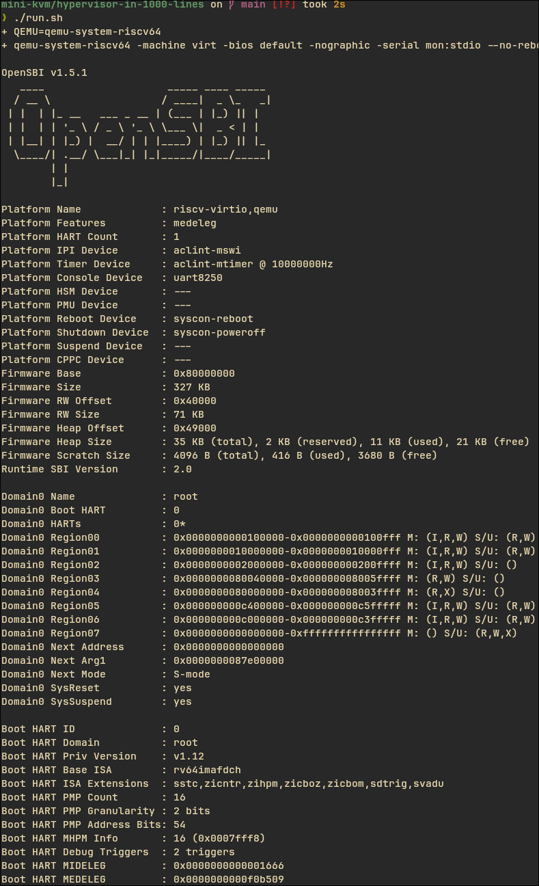

# 5-6주차 연구내용

목표: vCPU 생성 및 제어, 메모리 입출력, VM 종료 코드 작성

저번주 todo:

- 전체 점검

## 연구 내용

추석 연휴로 인해 5주차 상담이 없어, 5-6주차 연구를 통합하여 진행합니다.

4주차까지 Bochs를 이용해 xv6를 부팅하려는 시도를 했으나, 여러 문제로 인해 큰 진전이 없었습니다. 교수님과의 상담을 통해, Bochs 접근 방식을 포기하고 새로운 전략을 시도하기로 했습니다.

### RISC-V와 Rust를 이용한 VMM 개발 튜토리얼 전략

x86는 복잡하기에, 교수님께서 추천하신 [RISC-V 아키텍처 기반의 VMM 개발 튜토리얼](https://1000hv.seiya.me/en/)을 따라가기로 했습니다.



> OpenSBI 펌웨어를 RISC-V 펌웨어로 구동하는 모습

### 튜토리얼 분석

#### 튜토리얼 개요

해당 튜토리얼은 RISC-V 아키텍처 기반의 하이퍼바이저를 Rust로 구현하는 방법을 소개합니다. 주요 특징은 다음과 같습니다:

- **언어**: Rust (bare-metal programming)
- **목표**: 약 1000줄 이내의 코드로 Linux 기반 게스트 OS 부팅
- **플랫폼**: RISC-V (QEMU 에뮬레이터 사용)
- **특징**: Type-1 하이퍼바이저 (bare-metal)

#### 튜토리얼 구성

튜토리얼은 총 13개 챕터로 구성되어 있습니다:

1. **Getting Started**: 개발 환경 구성 (Rust, QEMU)
2. **Boot**: 하이퍼바이저 부팅
3. **Hello World**: 기본 출력
4. **Memory Allocation**: 메모리 할당 구현
5. **Guest Mode**: 게스트 모드 진입
6. **Guest Page Table**: 게스트 페이지 테이블 설정
7. **Hello from Guest**: 게스트에서 실행
8. **Build Linux Kernel**: 리눅스 커널 빌드
9. **Boot Linux**: 리눅스 부팅
10. **Supervisor Binary Interface**: SBI 구현
11. **Memory Mapped I/O**: MMIO 처리
12. **Interrupt Injection**: 인터럽트 주입
13. **Outro**: 마무리

### 튜토리얼 실습 시도

#### 환경 설정

튜토리얼 요구사항:
- Rust toolchain (rustup)
- QEMU (qemu-system-riscv64)

```bash
# Rust 설치는 이미 완료
rustc --version

# QEMU RISC-V 에뮬레이터 설치
sudo apt install qemu-system-riscv64
```

#### 튜토리얼에서 배운 핵심 개념

튜토리얼을 따라가며 하이퍼바이저의 핵심 구조를 이해할 수 있었습니다:

1. **Boot & Memory**: 하이퍼바이저 초기화, 메모리 할당 구조
2. **Guest Mode**: 호스트 모드와 게스트 모드 전환 메커니즘
3. **Page Table**: 게스트 물리 메모리를 호스트 메모리에 매핑하는 방식
4. **VM Exit 처리**: 게스트에서 발생한 이벤트를 하이퍼바이저가 처리하는 패턴

#### 발견한 문제점

1. **튜토리얼 미완성**: 튜토리얼 첫 페이지에 "This book is work in progress"라는 경고가 명시되어 있으며, 8장 이후 내용이 불완전함
2. **실습 환경 문제**: 일부 챕터에서 코드가 제대로 작동하지 않거나 설명이 불완전함
3. **아키텍처 차이**: RISC-V 기반이라 x86 KVM에 직접 적용하려면 변환 작업이 필요

### x86 KVM으로 전환

튜토리얼에서 배운 하이퍼바이저 구조를 바탕으로, 교수님이 제안하신 대로 x86 KVM API를 사용하는 방식으로 전환하기로 했습니다.

#### 1. KVM API 공식 문서

Linux 커널의 [KVM API 문서](https://www.kernel.org/doc/html/latest/virt/kvm/api.html)를 참고했습니다.

**핵심 KVM API 함수들:**

- `open("/dev/kvm")`: KVM 서브시스템 핸들 획득
- `KVM_CREATE_VM`: VM 생성
- `KVM_CREATE_VCPU`: vCPU 생성
- `KVM_SET_USER_MEMORY_REGION`: 게스트 메모리 설정
- `KVM_RUN`: vCPU 실행

**기본 워크플로우:**

```
1. /dev/kvm 열기
2. KVM_CREATE_VM으로 VM 생성
3. KVM_SET_USER_MEMORY_REGION으로 게스트 메모리 매핑
4. KVM_CREATE_VCPU로 vCPU 생성
5. vCPU 레지스터 설정 (KVM_SET_REGS, KVM_SET_SREGS)
6. KVM_RUN으로 게스트 코드 실행
7. VM Exit 처리
```

#### 2. Hypervisor From Scratch

[Hypervisor From Scratch](https://rayanfam.com/topics/hypervisor-from-scratch-part-1/) 시리즈도 검토했습니다.

- x86 아키텍처 기반
- Intel VT-x 기술 사용
- Windows 환경 중심의 설명
- 더 저수준의 하드웨어 가상화 접근

#### 3. 간단한 KVM 예제 코드 검색

"simple kvm example c" 등의 키워드로 검색하여 실제 작동하는 최소한의 예제 코드를 찾아보려 했으나, 대부분의 예제들이 QEMU나 다른 복잡한 VMM의 일부로 존재하거나, 오래되어 현재 KVM API와 맞지 않는 경우가 많았습니다.

### x86 KVM 구현 전략

여러 시도와 조사를 통해 다음과 같은 구현 전략을 수립했습니다:

#### RISC-V 튜토리얼에서 얻은 인사이트

1. **하이퍼바이저 구조 이해**
   - Boot: 하이퍼바이저 초기화 과정
   - Memory: 게스트 메모리를 호스트 메모리에 매핑
   - Guest Mode: 호스트/게스트 모드 전환 메커니즘
   
2. **KVM API 사용 패턴**
   - VM/vCPU 생성 및 관리
   - 메모리 영역 설정
   - VM Exit 처리 구조

#### x86 KVM 적용 계획

**RISC-V에서 배운 개념을 x86 KVM으로 적용:**

1. **KVM API 핵심 함수 학습**
   - `KVM_CREATE_VM`: VM 생성
   - `KVM_CREATE_VCPU`: vCPU 생성
   - `KVM_SET_USER_MEMORY_REGION`: 메모리 설정
   - `KVM_RUN`: 실행
   - `KVM_GET_REGS/KVM_SET_REGS`: 레지스터 제어

2. **최소한의 x86 KVM 프로그램 작성 목표**
   - C 언어로 간단한 코드 작성 (Rust 대신 C로 전환)
   - VM 생성, 메모리 할당, 간단한 게스트 코드 실행
   - 튜토리얼에서 배운 구조를 x86 환경에 적용

3. **참고 자료**
   - Linux KVM 공식 문서
   - QEMU 소스 코드 (KVM 사용 부분)
   - Bochs 소스 코드 (에뮬레이션 로직 참고)

### 다음 단계 계획

1. **기초 KVM 프로그램 작성 (Week 7-8)**
   - C로 최소한의 KVM 프로그램 작성
   - VM 생성 및 메모리 할당 구현
   - 간단한 게스트 코드 (예: 16비트 모드에서 HLT 명령) 실행

2. **vCPU 제어 및 레지스터 관리 (Week 8-9)**
   - vCPU 레지스터 설정 및 읽기
   - VM Exit 처리
   - 간단한 I/O 에뮬레이션

3. **메모리 관리 확장 (Week 9-10)**
   - 게스트 물리 메모리 관리
   - 페이지 테이블 설정
   - 메모리 매핑 I/O

4. **부트로더 실행 (Week 10-11)**
   - 간단한 부트로더 코드 실행
   - xv6 부트 프로세스 이해 및 적용

### 교훈

1. **아키텍처별 학습의 장점**: RISC-V가 단순해서 하이퍼바이저 핵심 개념을 이해하기 좋았음
2. **미완성 튜토리얼의 한계**: 8장 이후 불완전하여 전체를 따라가기는 어려웠지만, 초반 개념 학습에는 유용
3. **단계적 전환 전략**: RISC-V에서 배운 구조를 x86에 적용하는 교수님의 접근법이 효과적

### 참고 자료

- [RISC-V Hypervisor Tutorial](https://1000hv.seiya.me/en/)
- [KVM API Documentation](https://www.kernel.org/doc/html/latest/virt/kvm/api.html)
- [Hypervisor From Scratch](https://rayanfam.com/topics/hypervisor-from-scratch-part-1/)
- [OSDev Wiki](https://wiki.osdev.org/)

## 결론

이번 주차에는 교수님이 추천하신 RISC-V 튜토리얼을 통해 하이퍼바이저의 핵심 구조(Boot, Memory, Guest Mode)를 이해할 수 있었습니다. 튜토리얼이 8장 이후로 미완성이지만, 초반 챕터에서 배운 개념들은 VMM의 전체 구조를 파악하는 데 큰 도움이 되었습니다.

다음 단계에서는 교수님 제안대로, RISC-V에서 배운 개념을 x86 KVM API에 적용하여 최소한의 C 프로그램을 작성하고, 단계적으로 기능을 확장해 나갈 계획입니다.
