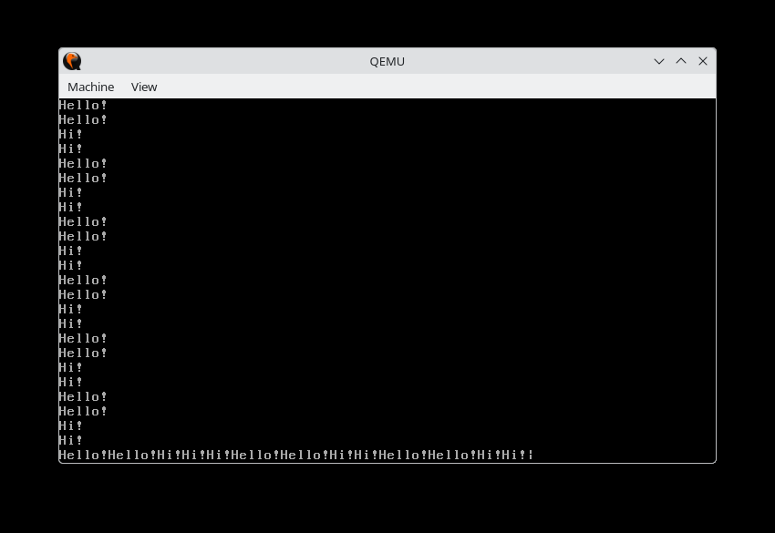

# 7-8주차 연구내용

목표: HLeOs 부팅 및 코드 분석

저번주 todo:

- 중간보고서 작성 및 제출

## 연구 내용

지난주 교수님과의 상담에서, Rust로 작성된 x86 기반 토이 OS인 HLeOs를 제공받았습니다. 이번 주에는 이 OS를 부팅하고 코드를 분석하는 것을 목표로 합니다.

### HLeOs 클론

교수님께서 제공해주신 [HLeOs](https://github.com/HLe4s/HLeOs) 레포지토리를 클론했습니다.

```bash
git clone https://github.com/HLe4s/HLeOs
cd HLeOs
```

레포지토리 구조를 보니, HLeOs 디렉토리 안에 또 HLeOs 디렉토리가 있습니다. 실제 OS 코드는 `HLeOs/HLeOs`에 있는 것 같습니다.

README.md를 읽어보니, 베어메탈 부팅, 인터럽트 처리, 페이징, 메모리 할당 등이 구현되어 있다고 합니다.

### 빌드 환경 설정

README에 Quick Start 가이드가 있어서 그대로 따라가보기로 했습니다. 순서는 다음과 같습니다:

1. Rust toolchain 설치 (cargo, rustup)
2. rust nightly로 override
3. bootimage 설치
4. rust-src 컴포넌트 추가
5. llvm-tools-preview 컴포넌트 추가
6. make

#### Rust 설치

시스템에 Rust의 stable 버전이 설치되어 있어서, nightly로 전환했습니다.

```bash
cd HLeOs/HLeOs
rustup override set nightly
```

#### 필요한 컴포넌트 설치

README에 명시된 대로 필요한 컴포넌트들을 설치했습니다.

```bash
cargo install bootimage
rustup component add rust-src --toolchain nightly-x86_64-unknown-linux-gnu
rustup component add llvm-tools-preview
```

### 첫 번째 빌드 시도

이제 `make` 명령으로 빌드를 시도해봤습니다.

```bash
make
```

그랬더니 다음과 같은 에러가 발생했습니다:

```
error: error loading target specification: target-pointer-width: invalid type: string "64", expected u16 at line 6 column 32
```

#### target specification 파일 문제

에러 메시지를 보니 `x86_64-HLeos.json` 파일의 `target-pointer-width` 필드가 문자열 "64"로 되어 있는데, u16 타입이 필요하다고 합니다.

`x86_64-HLeos.json` 파일을 확인해보니:

```json
{
    "llvm-target": "x86_64-unknown-none",
    ...
    "target-pointer-width": "64",
    ...
}
```

이 부분이 문제였습니다. 아마 HLeOs가 작성될 당시의 Rust 버전에서는 문자열을 허용했지만, 최신 nightly 버전에서는 숫자 타입을 요구하는 것 같습니다.

따라서 `x86_64-HLeos.json`를 다음과 같이 수정했습니다:

```json
"target-pointer-width": 64,
"target-c-int-width": 32,
```

### 두 번째 빌드 시도

다시 `make`를 실행해봤습니다. 그랬더니 이번에는 다른 에러가 발생했습니다:

```
error: error loading target specification: target feature `soft-float` is incompatible with the ABI but gets enabled in target spec
```

#### soft-float 피처 문제

`soft-float` 피처가 ABI와 호환되지 않는다는 에러입니다. `x86_64-HLeos.json`의 features 필드를 보니:

```json
"features": "-mmx,-sse,+soft-float"
```

이것도 Rust 버전이 바뀌면서 생긴 문제인 것 같습니다. x86_64 아키텍처에서 soft-float를 사용하는 것이 이제는 허용되지 않는 것 같습니다.

따라서 `x86_64-HLeos.json`을 다음과 같이 수정했습니다:

```json
"features": "-mmx,-sse"
```

### 세 번째 빌드 시도

다시 `make`를 실행했습니다. 이번에는 Rust 코드는 컴파일이 시작되었지만, C 코드 컴파일에서 에러가 발생했습니다:

```
c_src/dummy_c.c:5:26: error: initialization of 'uint16_t *' {aka 'short unsigned int *'} from 'int' makes pointer from integer without a cast [-Wint-conversion]
    5 |         uint16_t * vgr = 0xb8000;
```

#### C 코드 타입 캐스팅 문제

`c_src/dummy_c.c` 파일을 확인해보니, VGA 텍스트 버퍼 주소를 포인터에 직접 대입하고 있었습니다:

```c
uint16_t * vgr = 0xb8000;
```

찾아보니, 최신 GCC에서는 정수를 포인터로 직접 대입하는 것을 허용하지 않습니다. 명시적으로 캐스팅이 필요해 보입니다.

따라서 `c_src/dummy_c.c`를 다음과 같이 수정했습니다:

```c
uint16_t * vgr = (uint16_t *)0xb8000;
```

### 네 번째 빌드 시도

다시 `make`를 실행했습니다. C 코드는 컴파일되었지만, Rust 코드 컴파일 중에 또 다른 에러가 발생했습니다:

```
rustc-LLVM ERROR: SSE register return with SSE disabled
```

#### SSE 레지스터 문제

SSE를 비활성화했는데 (`"-mmx,-sse"`), SSE 레지스터를 사용하는 리턴이 있다는 에러입니다.

이 문제는 soft-float를 제거했기 때문에 생긴 것 같습니다. SSE를 비활성화하면 부동소수점 연산을 위해 soft-float나 x87 FPU를 사용해야 하는데, 둘 다 설정되지 않은 상태입니다.

생각해보니, 이런 호환성 문제들은 모두 Rust nightly 버전이 문제로 보입니다. 그러면 HLeOs가 개발될 당시의 Rust nightly 버전을 사용하면 이런 문제들이 없을 것 같습니다.

#### 과거 Rust nightly 버전 설치

HLeOs의 마지막 커밋 날짜를 확인해봤더니,
2024년 2월 22일이었습니다. 하지만 이건 README 업데이트 커밋이고, 실제 개발 커밋들을 확인해봤습니다.

```bash
$ git log --format="%ci %s" | grep -E "(Ch\.|bug fix final|enable)" | head -5
2023-09-24 15:27:55 +0900 enable c include
2023-09-23 17:04:32 +0900 bug fix final
2023-09-20 12:16:19 +0900 enable to link a c object file
2022-05-12 21:40:12 +0900 Ch.06 Multi Tasking
```

실제 주요 개발은 2023년 9월에 이루어진 것으로 보입니다! 그렇다면 2023년 9월경의 Rust nightly를 사용해야 할 것 같습니다.

2023년 9월 24일경의 Rust nightly를 설치해봤습니다:

```bash
rustup install nightly-2023-09-24
rustup override set nightly-2023-09-24
rustup component add rust-src --toolchain nightly-2023-09-24-x86_64-unknown-linux-gnu
rustup component add llvm-tools-preview --toolchain nightly-2023-09-24-x86_64-unknown-linux-gnu
```

### 여섯 번째 빌드 시도

2023-09-24 nightly로 빌드를 시도했습니다:

```bash
cargo clean
make
```

하지만 x86_64 크레이트에서 40개의 에러가 발생했습니다. 2023년 9월은 너무 오래된 것 같습니다.

생각해보니, "bug fix final" 커밋이 2023년 9월 23일이고, 그 이후 2024년 2월까지 README 업데이트만 있었다는 건, 2023년 10월~2024년 1월 사이 어느 시점의 Rust nightly가 정상 작동했을 것입니다.

2023년 11월경을 시도해봤습니다:

```bash
rustup install nightly-2023-11-01
rustup override set nightly-2023-11-01
rustup component add rust-src --toolchain nightly-2023-11-01-x86_64-unknown-linux-gnu
rustup component add llvm-tools-preview --toolchain nightly-2023-11-01-x86_64-unknown-linux-gnu
```

### 일곱 번째 빌드 시도

2023-11-01 nightly로도 여전히 x86_64 크레이트에서 같은 에러가 발생했습니다. 문제는 bootloader 0.9.8이 사용하는 x86_64 크레이트 버전이 오래되어, 최신 Rust와 호환되지 않는 것으로 판단했습니다.

#### bootloader 버전 변경

따라서 bootloader 버전을 0.9.23으로 올려봤습니다:

```toml
bootloader = "=0.9.23"
```

그리고 2024-01-15 nightly로 빌드를 시도했습니다:

```bash
rustup install nightly-2024-01-15
rustup override set nightly-2024-01-15
rustup component add rust-src --toolchain nightly-2024-01-15-x86_64-unknown-linux-gnu
rustup component add llvm-tools-preview --toolchain nightly-2024-01-15-x86_64-unknown-linux-gnu
cargo clean
make
```

드디어 빌드에 성공했습니다!

```
Created bootimage for `HLeOs` at `/home/seolcu/문서/코드/mini-kvm/HLeOs/HLeOs/target/x86_64-HLeos/debug/bootimage-HLeOs.bin`
```

### HLeOs 실행

#### Makefile 경로 수정

`make run`을 실행하니 Makefile에 하드코딩된 경로 때문에 에러가 발생했습니다. 7번 줄의 `WORKING_DIR`을 수정했습니다:

```makefile
WORKING_DIR=/home/seolcu/문서/코드/mini-kvm/HLeOs/HLeOs
```

#### xauth 에러 해결

다시 `make run`을 실행하니 xauth 에러가 발생했습니다:

```
xauth:  file /home/seolcu/.Xauthority does not exist
xauth: (argv):1:  bad "add" command line
```

Makefile 24번째 줄의 xauth 라인은 X11 forwarding을 위한 것인데, 저는 Wayland를 사용중이라 `.Xauthority` 파일이 없어서 문제가 발생했습니다. 이 라인을 주석 처리했습니다:

```makefile
run : $(IMAGE_DIR)
	# sudo xauth add `xauth -f $(HOME)/.Xauthority list|tail -1`
	sudo qemu-system-x86_64 -drive format=raw,file=$(IMAGE_DIR) -enable-kvm -m 2G
```

이제 `make run`을 했더니, 다음과 같은 결과가 나왔습니다.



QEMU가 실행되고 화면에 엄청나게 빠른 속도로 `Hello!Hi!Hello!Hi!...` 같은 문자들이 출력되기 시작했습니다!

### 코드 분석 - 멀티태스킹

HLeOs가 정상적으로 실행되고 있는 것 같은데, 왜 이렇게 빠르게 "Hello!"와 "Hi!"가 번갈아 출력되는지 궁금해서 코드를 살펴봤습니다.

`src/main.rs`를 확인해보니, 다음과 같이 여러 개의 스레드를 생성하고 있었습니다:

```rust
let print_hello = thread::Thread::new_with_func(jobs::print_hello as usize, 1, None);
let print_hi = thread::Thread::new_with_func(jobs::print_hi as usize, 1, None);
let getch_main = thread::Thread::new_with_func(jobs::getch_main as usize, 0, None);
let dummy = thread::Thread::new_with_func(dummy_c as usize, 0, None);
```

`src/hleos/thread/jobs.rs`를 보니, `print_hello`와 `print_hi` 함수가 각각 무한 루프를 돌면서 "Hello!"와 "Hi!"를 출력하고 있었습니다:

```rust
pub extern "C" fn print_hello() {
    loop {
        print!("Hello!");
    }
}

pub extern "C" fn print_hi() {
    loop {
        print!("Hi!");
    }
}
```

그리고 `src/main.rs`에서 타이머 인터럽트를 설정하는 부분을 발견했습니다:

```rust
timer::init_timer(&TIMER_INFO);
```

타이머 인터럽트가 발생할 때마다 스케줄러가 스레드를 전환하는 방식으로 멀티태스킹이 구현되어 있는 것 같습니다. 그래서 `print_hello`와 `print_hi` 스레드가 타이머에 의해 번갈아가며 실행되면서, 화면에 "Hello!"와 "Hi!"가 빠르게 출력되는 것입니다.

## 결론

HLeOs를 성공적으로 빌드하고 실행했습니다! 과정에서 여러 호환성 문제들을 만났지만, 결국 다음과 같은 해결책으로 성공할 수 있었습니다:

1. **bootloader 버전 업데이트**: 0.9.8 → 0.9.23
2. **Rust nightly 버전**: nightly-2024-01-15 사용
3. **C 코드 수정**: 포인터 캐스팅 추가
4. **Makefile 수정**: 경로 업데이트 및 xauth 라인 주석 처리

HLeOs는 베어메탈 환경에서 실행되는 간단한 OS로, 타이머 기반의 멀티태스킹을 구현하고 있습니다. 다음 주에는 이 코드를 더 자세히 분석하고, 메모리 관리나 인터럽트 핸들링 같은 부분을 공부해볼 예정입니다.
