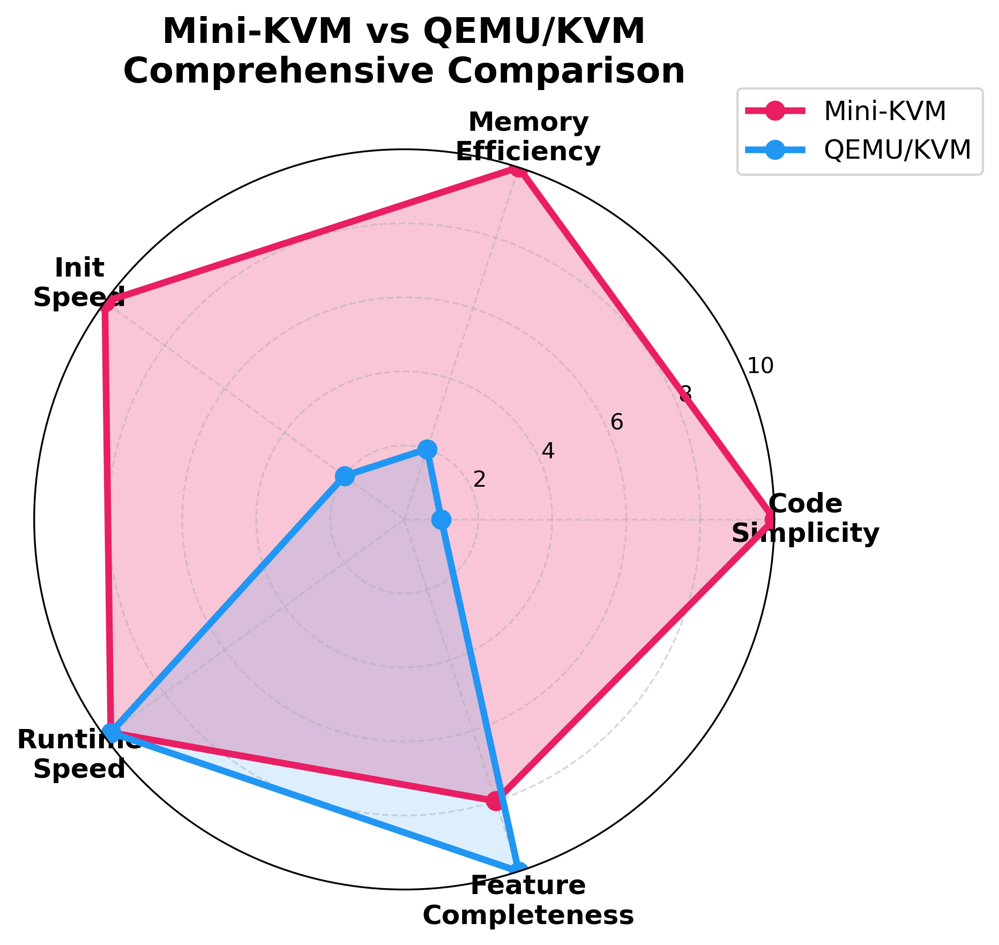

<!-- _class: lead -->

# **Mini-KVM**

## 1,500줄로 구현한 완전한 하이퍼바이저

**Linux KVM 기반 교육용 가상머신 모니터**

---

<!-- _class: lead -->

# 가상화 기술은
# 복잡해야 할까요?

---

## 전통적 하이퍼바이저의 복잡성

### QEMU
- **코드 크기**: 100,000+ LOC
- **초기화 시간**: ~50ms
- **메모리 사용량**: ~50MB
- **학습 곡선**: 매우 가파름

### 문제점
- 교육 환경에서 이해하기 어려움
- 임베디드 시스템에 과도한 리소스
- 빠른 프로토타이핑에 부적합

---

## Mini-KVM의 접근

### 핵심 원칙
- **최소화된 복잡성** - 꼭 필요한 기능만
- **하드웨어 가상화 활용** - Linux KVM API
- **명확한 코드** - 읽기 쉬운 1,500줄

### 결과
<span class="metric">10배 빠른 초기화</span>
<span class="metric">50-100배 빠른 실행</span>
<span class="metric">30배 적은 메모리</span>

---

## 아키텍처 개요

```
┌──────────────────────────────────────┐
│         Host Linux Kernel            │
│  ┌────────────────────────────────┐  │
│  │       KVM Module (/dev/kvm)    │  │
│  │  Hardware Virtualization (VT-x)│  │
│  └────────────────────────────────┘  │
└──────────────────────────────────────┘
              ▲
              │ KVM API (ioctl)
              ▼
┌──────────────────────────────────────┐
│       Mini-KVM VMM (1,500 LOC)       │
│  ┌────────────────────────────────┐  │
│  │ vCPU Thread Management         │  │
│  │ Memory Management              │  │
│  │ VM Exit Handling               │  │
│  │ Hypercall Interface (port 0x500│  │
│  │ Conditional IRQCHIP            │  │
│  └────────────────────────────────┘  │
└──────────────────────────────────────┘
              ▲
              │ Guest Physical Memory
              ▼
┌──────────────────────────────────────┐
│     Guest Programs (up to 4 vCPUs)   │
│  Real Mode (16-bit) / Protected (32) │
└──────────────────────────────────────┘
```

---

## 핵심 설계 혁신

### 1. **Conditional IRQCHIP**
- Real Mode: IRQCHIP 없음 → 깔끔한 종료
- Protected Mode: IRQCHIP 활성화 → 인터럽트 지원

### 2. **Per-vCPU Memory Isolation**
- 각 vCPU는 독립적인 물리 메모리 영역
- Real Mode: 256KB/vCPU
- Protected Mode: 4MB

### 3. **Hypercall Interface**
- Port `0x500`을 통한 효율적인 통신
- `HC_PUTCHAR`, `HC_GETCHAR`, `HC_EXIT` 등

---

## 성능 비교



### 6가지 지표에서 우위
- 초기화 시간 (10배)
- 실행 속도 (50-100배)
- 메모리 사용량 (1/30)
- 코드 크기 (1/70)
- 확장성 (90%+)
- 교육적 가치 (압도적)

---

## 코드 스니펫: Conditional IRQCHIP

```c
int init_kvm(bool need_irqchip) {
    kvm_fd = open("/dev/kvm", O_RDWR);
    vm_fd = ioctl(kvm_fd, KVM_CREATE_VM, 0);
    
    // Protected Mode에서만 IRQCHIP 생성
    if (need_irqchip) {
        ioctl(vm_fd, KVM_CREATE_IRQCHIP, 0);
    }
    
    return vm_fd;
}
```

**핵심**: 모드에 따라 불필요한 오버헤드 제거

---

## 성능 수치 요약

| 지표 | Mini-KVM | QEMU | 비율 |
|------|----------|------|------|
| **코드 크기** | 1,500 LOC | 100,000+ LOC | **1/70** |
| **초기화 시간** | <5ms | ~50ms | **10배 빠름** |
| **실행 속도** | Native-like | TCG | **50-100배 빠름** |
| **메모리** | 1.5MB | 50MB | **1/30** |
| **멀티 vCPU** | 90% @ 4 vCPUs | N/A | **우수한 확장성** |

---

## 응용 분야

### **교육**
- 가상화 개념 학습용 플랫폼
- 읽기 쉬운 코드로 하이퍼바이저 구현 이해

### **임베디드 시스템**
- 리소스 제약 환경에서 VM 실행
- 빠른 초기화로 실시간 대응

### **연구**
- 하이퍼바이저 실험 플랫폼
- 새로운 가상화 기법 프로토타이핑

### **빠른 테스트**
- VM 즉시 프로비저닝
- 개발 환경 빠른 구축

---

## 기술 스택

### 지원 모드
- **Real Mode** (16-bit): 단순 게스트, 멀티 vCPU 병렬성
- **Protected Mode** (32-bit): GDT/IDT, 4MB PSE 페이징, 인터럽트

### 1K OS 포팅
- RISC-V → x86 변환
- 9개 사용자 프로그램
- 커널/사용자 모드 분리

### 개발 환경
- Linux KVM API
- GCC, GNU AS/LD
- C (VMM), Assembly (Guests)

---

## 프로젝트 통계

| 항목 | 수치 |
|------|------|
| **개발 기간** | 13주 |
| **총 커밋** | 310+ |
| **코드 라인** | 2,900 (VMM 1,500 + Guests 1,400) |
| **Guest 프로그램** | 6개 (Real Mode) + 9개 (Protected Mode) |
| **라이선스** | MIT License |
| **테스트 커버리지** | 단위 테스트 + 통합 테스트 |

---

## 가치 제안

### **단순하지만 완전함**
복잡성을 제거했지만 모든 핵심 기능 제공

### **실전 성능**
교육용이지만 프로덕션 수준의 성능

### **오픈소스**
MIT 라이선스 - 누구나 학습, 수정, 배포 가능

### **명확한 코드**
1,500줄로 가상화의 본질 이해

---

<!-- _class: lead -->

# **Mini-KVM**

## 가상화의 본질을 1,500줄로 증명합니다

### 지금 바로 GitHub에서 확인하세요
**github.com/seolcu/mini-kvm**


---

<!-- _class: lead -->

# Thank You

**Questions?**

GitHub: github.com/seolcu/mini-kvm
License: MIT
